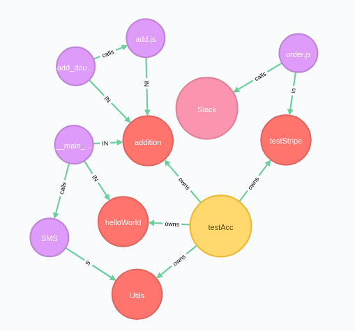

# neoStandard

_Neo4j graphing tool of stdlib microservice infrastructure_

### __Example graph:__

The goal of this project is to create a more user-friendly interface for the monitoring and deployment of new microservice APIs on StdLib by converting existing StdLib user infrastructure to a graph representation using Neo4j. This project was originally started during NWHacks 2019, and is currently on standby due to limitations with the StdLib developer API.

### __Completion Checklist:__
* [x] Parse services and function APIs into graph representation
* [x] Map relationships between functions, services, and users
* [ ] Add details for 3rd-party server interactions
* [ ] Create a quick deployment API for creating new microservices as nodes in Neo4j
* [ ] Convert project to a deployable API for StdLib

### __Development Checklist:__
* [ ] Add automated deployment and test scripts
* [ ] Convert the existing codebase to Go (JavaScript async queuing is a bad fit for this project)
